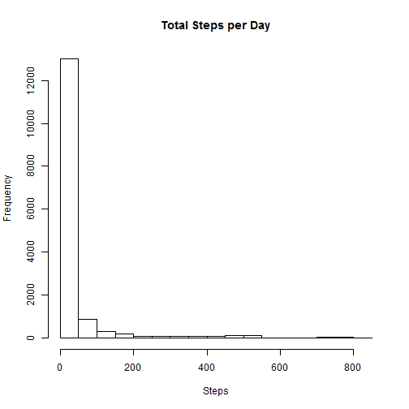

# Reproducible Research: Peer Assessment 1


## Loading and preprocessing the data


Unzip "activity.zip" file--assumed to be on the working directory
read file, gather complete cases and convert dates from strings into 
date objects:


```r
 file <- unzip("activity.zip")
        steps <- read.csv(file)
        steps <- steps[complete.cases(steps),]
        steps$date<-as.Date(steps$date)
```
 
#What is mean total number of steps taken per day?
#generate histogram of steps and calculate meanand median steps per day


```r
        hist(steps$steps, main = "Total Steps per Day", xlab = "Steps")
```

 

```r
        mean(steps$steps)
```

```
## [1] 37.38
```

```r
        median(steps$steps)
```

```
## [1] 0
```

## What is the average daily activity pattern?


## Imputing missing values


## Are there differences in activity patterns between weekdays and weekends?
