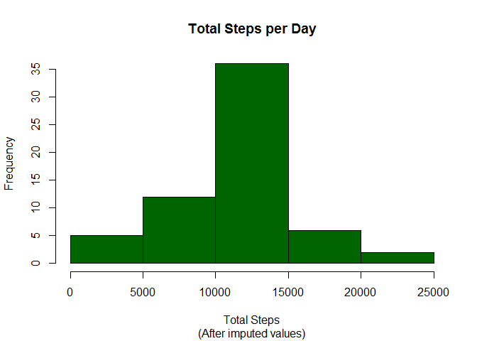
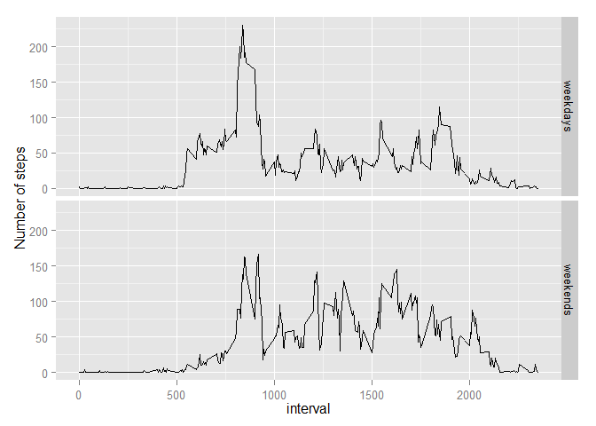

Reproducible Research: Peer Assessment 1
======================================================================

### Loading and preprocessing the data

 
- Unzip "activity.zip" file--assumed to be on the working directory
read file
- gather complete cases and convert dates from strings into 
date objects:


```r
        file <- unzip("activity.zip")
        steps <- read.csv(file)      
        steps$date<-as.Date(steps$date)
```
 
#What is the mean total number of steps taken per day?
###Generate histogram of steps and calculate mean and median steps per day

- Aggregate steps by day
- Generate histogram
- Calculate **mean** and **median** values


```r
        daily.steps <-aggregate(steps~date,steps,sum)[,2]
        dates <-aggregate(steps~date,steps,sum)[,1]
        hist(daily.steps, main = "Total Steps per Day", xlab = "Total Steps", col="darkorange")
```

 

```r
        mean(daily.steps)
```

```
## [1] 10766
```

```r
        median(daily.steps)
```

```
## [1] 10765
```

## What is the average daily activity pattern?

- Make a time series plot (i.e. type = "l") of the 5-minute interval (x-axis) and the average number of steps taken, averaged across all days (y-axis)


```r
        daily.pattern<-aggregate(steps~interval,steps,mean)
        plot(daily.pattern$interval,daily.pattern$steps, type="l", main= "Daily Activity Pattern", xlab="5-minute activity interval", ylab="Average number of steps",col = "darkorange")
```

 

- Which 5-minute interval, on average across all the days in the dataset, contains the maximum number of steps?


```r
        daily.pattern[daily.pattern$steps==max(daily.pattern$steps),]$interval
```

```
## [1] 835
```

## Imputing missing values

- Number of missing values in the dataset:


```r
sum(!complete.cases(steps))
```

```
## [1] 2304
```

- impute missing values by replacin NA values with their corresponding interval average.


```r
        for (i in 1:length(steps$steps)){
                for(interval in daily.pattern$interval){
                        if(sum(steps$interval[i]==interval)==1 && is.na(steps$steps[i])){steps$steps[i] <- daily.pattern$steps[daily.pattern$interval==interval]}
                }
        }
```

- create histogram of steps by day with new imputed values


```r
daily.steps.new <-aggregate(steps~date,steps,sum)[,2]
        dates <-aggregate(steps~date,steps,sum)[,1]
        hist(daily.steps.new, main = "Total Steps per Day",sub = "(After imputed values)", xlab = "Total Steps", col="darkgreen")
```

 

```r
        mean(daily.steps.new)
```

```
## [1] 10766
```

```r
        median(daily.steps.new)
```

```
## [1] 10766
```

- It seems to be no significant difference in the mean and median values after introducing the imputed values.

## Are there differences in activity patterns between weekdays and weekends?

- Create vector with weekday/weekend factor
- Add weekday/weekend factor to steps data frame
- Create separate data frames for weekdays and weekends
- bind data sets and create a panel graph


```r
steps2 <-steps
weeklogic<-(weekdays(steps2$date)== "Saturday" | weekdays(steps2$date)== "Sunday")
        weekend<-rep("weekday",length(steps2$date))
        weekend[weeklogic]<-"weekend"
        weekend<-as.factor(weekend)
        steps2$weekend<-weekend
        steps.weekdays<-as.data.frame(steps2[steps2$weekend=="weekday",])
        steps.weekends<-as.data.frame(steps2[steps2$weekend=="weekend",])
        daily.pattern.weekends <- aggregate(steps~interval,steps.weekends,mean)
        daily.pattern.weekdays <- aggregate(steps~interval,steps.weekdays,mean)
        daily.pattern.weekends$weekends<-rep("weekends",length(daily.pattern.weekends$steps))
        daily.pattern.weekdays$weekends<-rep("weekdays",length(daily.pattern.weekdays$steps))
        daily.pattern<-rbind(daily.pattern.weekends,daily.pattern.weekdays)
        library(ggplot2)
```

```
## Warning: package 'ggplot2' was built under R version 3.0.3
```

```r
        qplot(x=interval,y=steps,data=daily.pattern,facets=weekends~.)           
```

 
